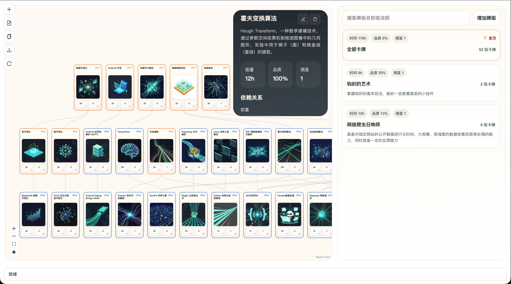

# 🃏 CardSensus: 点亮你的人生技能树

🌐 Language: **中文** | [English](docs/README.en.md)

<div align="left">


</div>



## 💡 TL;DR

现实生活没有进度条，但 CardSensus 给你造了一个。把你的爱好、专长和踩过的坑，变成一张张发光的卡牌。在这里，人生就是一场拥有无限分支技能树的 RPG 游戏。

## 🌍 哪怕是生活，也要有打怪升级的爽感

我们都有过这样的焦虑和遗憾：

买过昂贵的钓鱼竿，报过三分钟热度的烘焙班，在收藏夹里存了几十个“一次看懂”的剪辑教程，甚至硬啃过几行晦涩的代码。但时间一长，这些经历都散落在了记忆里。你很难清楚地向自己或别人证明：“我到底擅长什么？我的技能边界在哪里？我离‘精通’还差几步？”

CardSensus 就是为了终结这种“人生迷雾”而生的。

我们将枯燥的“学习记录”彻底游戏化。不论是硬核的学术知识，还是充满烟火气的生活技能，万物皆可被铸造为卡牌。每一次下厨、每一次抛竿、每一次专注的钻研，都是点亮这棵庞大“人生科技树”的经验值。

## 🔥 核心玩法

1. **🃏 万物皆卡牌 (Card Everything)**：不要被“科技”这个词局限了。在 CardSensus，“Python 自动化”是一张卡，“路亚钓鱼”是一张卡，甚至“惠灵顿牛排制作”也是一张卡。卡牌正面将展示你的技能熟练度与累计投入的真实时长，卡牌背面刻印着你的专属“初见”足迹（比如：“首次在周末露营中点亮该技能”）。

2. **👑 拒绝钦定，稀有度由「共识」决定 (Crowdsourced Rarity)**：凭什么某些技能的含金量更高？官方说了不算，由地球Online的玩家说了算。卡牌分为普通、稀有、史诗和传说。这个稀有度是通过全网玩家的众包数据动态计算的——达成人数越少、平均钻研时间越长的冷门/硬核技能，稀有度就越高。想要炫耀？把那张全网只有 5% 玩家点亮的「深海船钓大师」传说卡牌亮出来吧！

3. **⚔️ 组建你的「人生流派」 (Skill Decks)**：单张卡牌可以连成庞大的技能树，更可以自由组合成牌组 (Deck)。你可以打包一套名为“米其林家庭主厨”的牌组，或者分享一套“数字游民硬核生存”牌组。小白玩家完全可以一键 Fork 领域大佬的通关牌组，沿着前人踩过的坑，一步步解锁自己的高阶技能树。

## 🚀 未来愿景
我们想做的不只是一个笔记工具，而是一种全新的高维社交名片。

想象一下：不久的将来，你可以在你的个人主页、博客甚至是朋友圈，挂上一张由 CardSensus 动态生成的 SVG 卡片。上面不是无聊的文字自我介绍，而是你最引以为傲的“人生流派牌组”和发着流光的“传说级技能节点”。

这就叫顶级玩家的浪漫。

## 🛠️ 致开发者与早期玩家
目前，CardSensus 的底层引擎已经跑通，完美支持这种多模态技能图谱的构建。任何人现在就可以在本地启动，体验“拓扑图编辑”和“牌组构建”的快感：

- [x] 无界丝滑的技能树画布：支持复杂的 DAG 节点拓扑与自动重排。
- [x] 卡牌炼金炉：随心所欲定义你的专属技能，一键连线打通上下游依赖。
- [x] 极客友好的数据流：底层由 JSON 驱动，支持草稿导入与图谱全量导出，为日后接入强大的图数据库做好了万全准备。
- [x] 前后端联动已打通：FastAPI 提供图谱与实体接口，React 画布实时消费并渲染技能关系。
- [x] 资源系统可直接挂载：后端已开放 `/files` 静态资源目录，卡牌图片与演示素材可本地即插即用。

### 📦 仓库结构

```text
CardSensus/
├─ backend/                        # FastAPI 后端服务
│  ├─ src/roadmap/                 # 业务核心（domain/application/infrastructure/presentation）
│  ├─ data/                        # 本地数据与文件资源
│  ├─ scripts/                     # 脚本工具
│  ├─ main.py                      # 后端启动入口
│  ├─ requirements.txt
│  └─ pyproject.toml
├─ frontend/                       # React + Vite 前端
│  ├─ src/app/                     # 应用级入口与路由装配
│  ├─ src/pages/                   # 页面层
│  ├─ src/widgets/                 # 页面级组件
│  ├─ src/features/                # 功能模块
│  ├─ src/entities/                # 领域实体
│  ├─ src/shared/                  # 共享能力（api/lib/ui）
│  └─ src/styles/                  # 全局样式
├─ docs/                           # 文档与演示资源
├─ tools/                          # 辅助工具（如 ImageGen）
├─ package.json                    # 根工作区脚本
└─ README.md
```

### ⚡ 极速启动 (本地部署)

后端引擎 (FastAPI)

```bash
cd backend
python3 -m venv .venv
source .venv/bin/activate
pip install -r requirements.txt
PYTHONPATH=src uvicorn main:app --reload
# 🚀 世界引擎将在 http://127.0.0.1:8000 点火
```

前端画布 (React + Vite)

```bash
cd frontend
npm install
npm run dev
# 🎨 你的人生画布将在 http://127.0.0.1:5173 展开
```

### 🧪 开发者调试面板 (可选但强烈推荐)

当你点燃后端引擎后，还可以直接打开 FastAPI 自带的 API 面板，快速检查每张“人生技能卡”是否按预期流转：

- Swagger UI：`http://127.0.0.1:8000/docs`
- ReDoc：`http://127.0.0.1:8000/redoc`
- 健康检查：`http://127.0.0.1:8000/health`

### 🧰 常用开发脚本

有些“装备”已经在仓库里了，适合你继续扩展 CardSensus 的生产力：

- `backend/scripts/generate_card_images.py`：批量生成/更新卡牌图片素材。
- `backend/scripts/test_llm_service.py`：快速验证 LLM 相关服务链路。
- `tools/ImageGen/`：图像生成相关工具目录，可作为素材管线起点。
